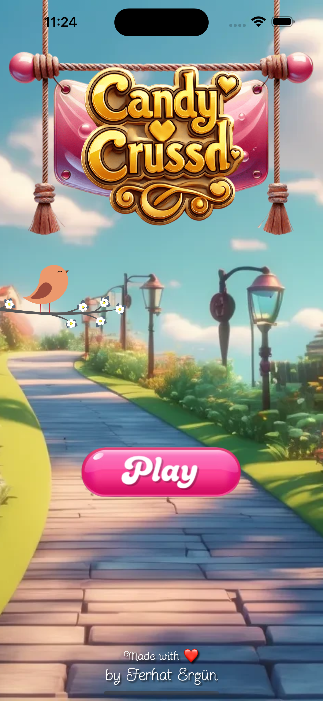
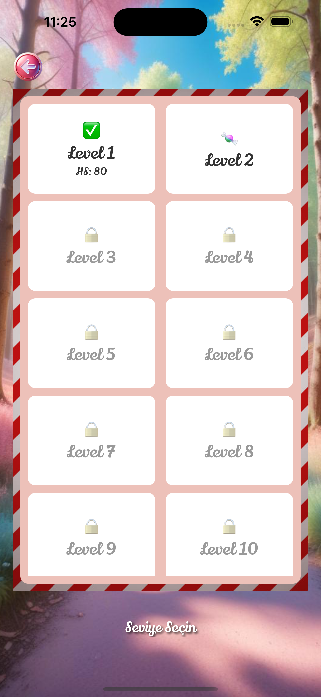
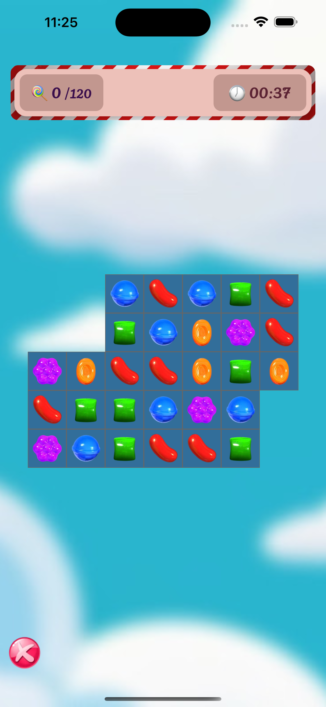

# Candy Crushed

Candy Crushed, React Native ve Expo kullanılarak geliştirilen eğlenceli bir mobil bulmaca oyunudur. Renkli şekerleri eşleştirerek seviyeleri geçmeye çalışırsınız. Animasyonlar, ses efektleri ve kullanıcı dostu arayüz ile keyifli bir oyun deneyimi sunar.

## Özellikler
- Farklı seviyeler ve zorluklar
- Renkli ve canlı grafikler
- Lottie animasyonları
- Arka plan müziği ve oyun içi sesler

## Kurulum
1. Depoyu klonlayın:
   ```bash
   git clone https://github.com/ferhatergun/candy-crushed.git
   ```
2. Bağımlılıkları yükleyin:
   ```bash
   npm install
   ```
3. Uygulamayı başlatın:
   ```bash
   npx expo start
   ```

   ## Kullanılan Teknolojiler
- React Native
- Expo
- TypeScript
- Lottie
- Reanimated


## Ekran Görüntüleri
| Ana Ekran | Seviye Seçme Ekranı | 
|------|--------|
|  |  |

| Oyun Ekranı |
|------|
|  |


